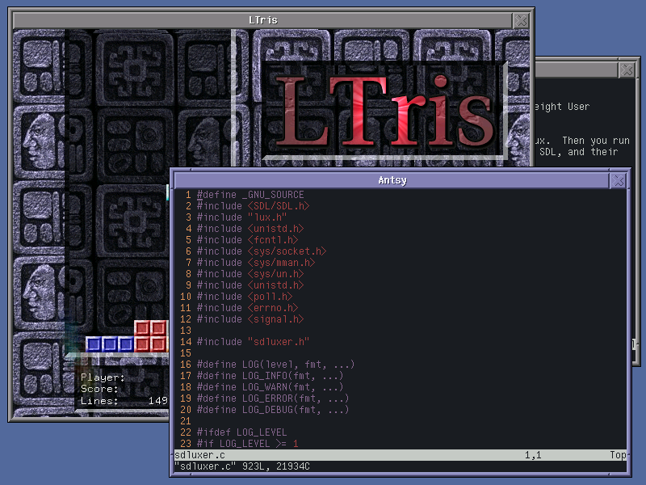

# SDLuxer

SDLuxer is an SDL 1.x multiplexer using the Lux/lux-gui [Lightweight User
eXperience library](https://github.com/MurphyMc/lux).

You run SDLuxer, and it acts like a window manager using Lux.  Then you run
SDL applications compiled with an SDLuxer-aware version of SDL, and they
show up as windows inside SDLuxer.  For example, here are a couple of
instances of the [Antsy](https://github.com/MurphyMc/antsy) terminal emulator
and the [LTris](http://lgames.sourceforge.net/LTris/) SDL game running in
an instance of SDLuxer:




## Building and Running SDLuxer

SDLuxer relies on Lux, which is a C library for drawing windows.  The
included CMake file expects Lux to be available in a "lux" directory inside
the SDLuxer directory.  The easiest way to accomplish this is to simply
clone the Lux repository into SDLuxer repository:
```
git clone https://github.com/MurphyMc/lux
```

Then you should be able to use CMake to build SDLuxer easily:
```
cmake .
cmake --build .
```

SDLuxer currently has only two commandline arguments, both of which are
optional.  The first is `-d`, which can be used to set the screen size,
e.g., `-d800x600`.  The second controls the name of the socket by which
applications connect to SDLuxer.  This defaults to `sdluxersock` in
whatever the current directory happens to be, but can be set using the
`-n` option.


## Building Applications For Use With SDLuxer

The [SDL](https://www.libsdl.org/) library abstracts away many of the
details of the system on which it is running, allowing the same basic code
to run on different operating systems and different environments.  The SDL
library contains support for quite a few options, but the official version
does not have support for SDLuxer.  Thus, you need to download a version of
SDL with SDLuxer and use that with your applications.  In many cases, it
should be possible to compile an SDLuxer-capable version of SDL as a shared
library (AKA DLL), use that to replace an existing SDL shared library, and
have things work.  When SDL has been statically linked, the application
will need to be recompiled.  The details of this are beyond the scope of
this README, and are largely covered by the SDL documentation and various
SDL mailing lists and so on.

A version of the SDL 1.2 codebase with support for SDLuxer can be gotten
from github at <https://github.com/MurphyMc/libsdl>.


## Running Applications Using SDLuxer

Once an application has SDLuxer support (e.g., by using an SDLuxer-capable
SDL shared library as described above), running the application is almost
as easy as just executing it -- all one needs to do first is to set the
`SDLUXER_SERVER` environment variable to the path to the SDLuxer socket
mentioned in the section of building and running SDLuxer.  For example, with
`bash`, one might do something like the following to run Antsy:
```
SDLUXER_SERVER=../sdluxersock ./antsy
```


## How SDLuxer Works

In some sense, SDLuxer is an ordinary SDL application itself.  It uses the
Lux library, which uses SDL to draw window decorations, manage the drawing
of window contents, provide a window-oriented API for mouse and keyboard
input, and so on -- much like an X11 window manager, or the basic windowing
features of macOS and Windows.

SDLuxer also listens on a Unix domain socket and expects client applications
to connect on it.  These applications have been compiled using a version of
the SDL library which knows how to connect to SDLuxer over this socket.
When such an application makes certain SDL-related calls (such as to create
a window), the request is packaged up, and sent over the socket to SDLuxer.
SDLuxer then acts on it (e.g., creating a Lux window), and may send a
response back over the socket.

Similarly, SDLuxer catches many Lux events (e.g., mouse movement over a
window), packages these into messages sent over the socket to the client
application, where they then appear as ordinary SDL events.

An exception to this is graphics data itself.  In the current version of
the protocol, rather than sending graphics over the socket (which requires
at least two copies of potentially a fair amount of data), SDLuxer creates
a POSIX shared memory object, the filename of this is sent over the socket,
and the client application opens it.  The client writes its pixel data
into the shared memory, and SDLuxer reads it directly from there.
